#Presentation with Speaker Notes
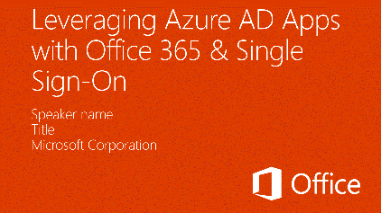

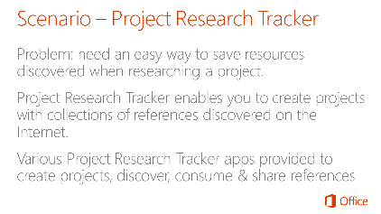

The sample scenario is a Project Research Tracker. The idea is that the web application makes it easy for users to create projects and add reference items found throughout the internet.

The scenario demonstrates how to create different types of applications that communicate with Office 365 & SharePoint Online while keeping with recommended programming practices.

All apps within this scenario follow a similar pattern.

An Azure AD directory is used to facilitate single sign-on capabilities. Each app in the scenario is registered as an application within the Azure AD directory and granted permissions to Office 365, specifically SharePoint Online.

Office 365, specifically SharePoint Online, is used to hold all the data stored and used within the different apps. Two lists will store all projects and project references.

There are a total of three apps demonstrated in this scenario:
- A single page app, also known as a SPA, that provides a rich browser based experience
- An Office Outlook App that extracts links from an email and adds them to an existing project
- An Office Word App that lets a user select one or more references in a project and add them to a table in a Word document

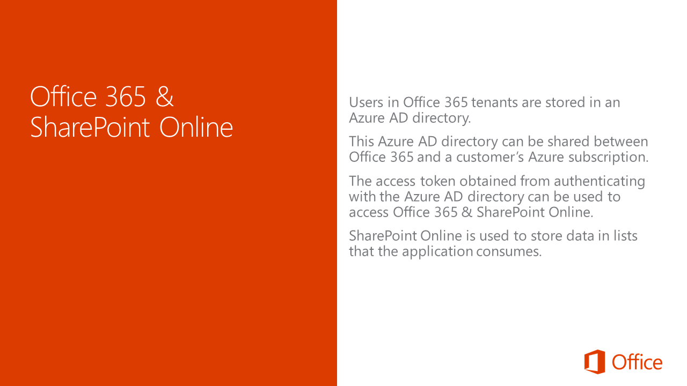

Let’s take a moment to talk a little about how Office 365 and SharePoint Online for our scenario.

All users within an Office 365 tenant are stored in an Azure AD directory. This Azure AD directory is no different from the directories that can be created and used within an Azure subscription.

Customers can add their Office 365 Azure AD directory to their Azure subscription and even configure a user within that directory to be the administrator of both the Office 365 tenant and the Azure subscription. This means that once authenticated, the same OAuth2 access token can be used to authenticate and gain access to Office 365 and Azure resources provided the user has the necessary permissions.

SharePoint Online is used to store all the data used within all applications. Specifically, there are two lists created when the user first accesses the single page app. One list will store all the projects and another will store all the references included in each project.

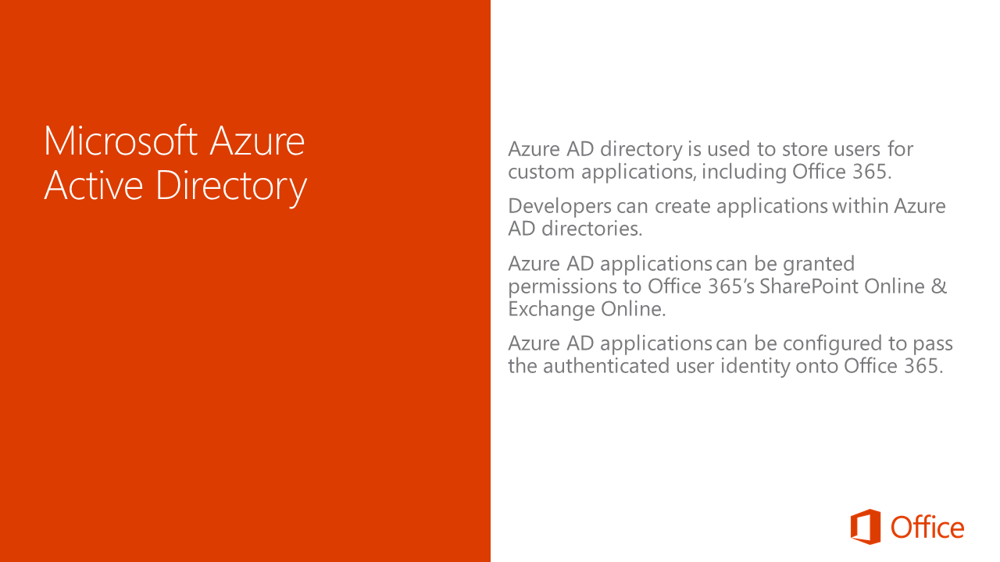

Azure AD directories can be used to not only store users and facilitate authentication for Office 365, Azure and custom applications but they also support creating applications.

These applications can be granted permissions and configured to pass the identity of a user onto Office 365, either Exchange Online or SharePoint Online. Apps can also be configured with specific rights within the target (Exchange Online / SharePoint Online) so that even if the user has permissions to do something in Office 365, the application can restrict what the Azure application can do.

This capability enables developers to create applications that can rely on the same Azure AD directory that powers the authentication of users in Office 365.

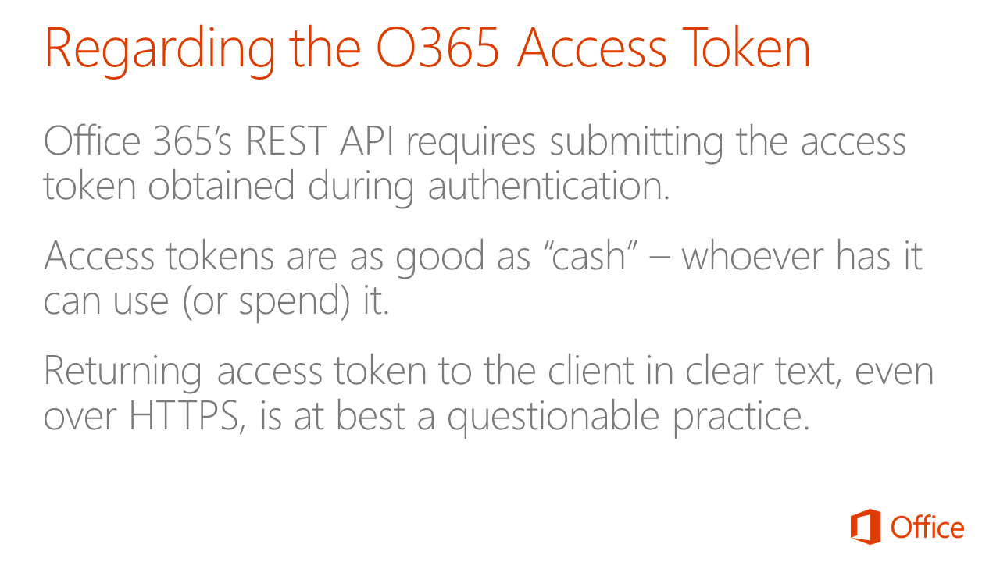

Before we proceed, we need to talk about the OAuth access token. The Office 365 APIs and REST APIs in SharePoint Online require that every HTTP request include the access token in the header of the request. As such your application will need to obtain an access token once they have authenticated with Azure AD.

Access tokens are as good as cash in the sense that the holder of the token is not important in the call. Whomever has the access token can use it, regardless of where the obtained it.

Therefore developers must exercise care in how they use and store access tokens. There is a fairly split debate between two different camps if it is ok to return the access token to the client (browser) for future calls. One side says this is ok because as long as everything happens over HTTPS, the access token is protected. The other side of the argument says the access token should never touch the client because if the client is compromised, it’s irrelevant that the token was transported over HTTPS – whoever has the token can use it.

Therefore it’s generally considered the safest practice to not distribute the access token to the client in clear text.

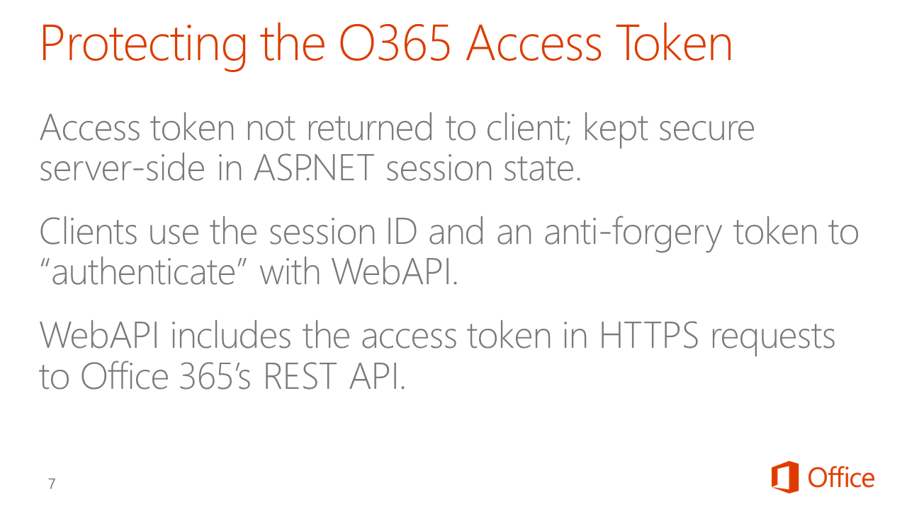

For the sample scenario in this session, none of the apps will ever directly touch the access token in the client. Instead the access token never leaves the server.

Each sample application has an intermediary application, an ASP.NET WebAPI project, that stores the access token it obtained from the Azure AD directory within a server-side session state. The clients authenticate and also send the session ID and an anti-forgery token to the ASP.NET WebAPI project. These are used by WebAPI to retrieve the access token from session state for inclusion of any HTTP requests sent to the Office 365 APIs and SharePoint Online REST APIs.

This way, the access token stays on the server-side solutions and never touches the client.

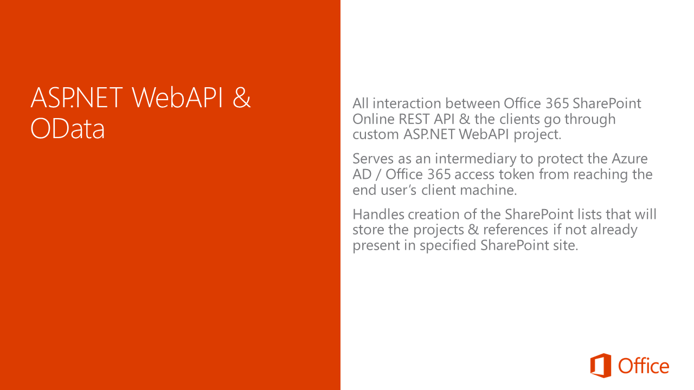

Now let’s take a minute to look at the intermediary ASP.NET WebAPI backend projects that will accompany each app.

None of the client apps within this scenario, including the single page application, the Office Outlook App or the Office Word App, communicate directly with Office 365 or SharePoint Online. All communication with Office 365 and SharePoint Online is handled by an ASP.NET WebAPI backend intermediary. The primary reason for this is to protect the OAuth2 access token we previously discussed.

In the case of the single page application, the ASP.NET WebAPI project is also responsible for creating the two lists that are used in all the apps in this scenario in the target SharePoint site if they are not already present.

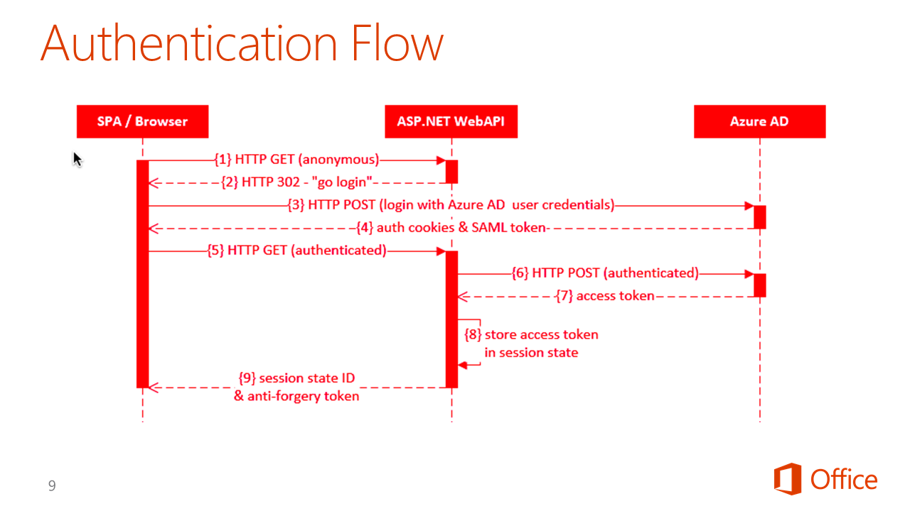

Let’s look at how the authentication flow happens in the ASP.NET WebAPI projects. Some of the steps are omitted form the UML sequence diagram on the slide, but all the important ones you need to understand are depicted here.

Everything starts with the user initially requesting the single page web application (1) that is configured to reject any non-authenticated requests. When it sees an anonymous request as shown in 1, it responds (2) with an HTTP 302 response pointing to the URL of the Azure AD login page.

The browser then goes straight (3) to the Azure AD login page and enters the username and password for a user within the Azure AD directory. Assuming the authentication is successful, Azure AD responds (4) with all the OAuth2 fedauth cookies and SAML token you typically receive when authenticating with an OAuth2 protected resource.

The browser then tries the initial request again to the WebAPI project to load the single page application (5) but this time with all the authentication headers. The WebAPI project will return the single page application web pages but it will also request (6) and retrieve an access token (7) from Azure AD using the user’s authentication data.

Once it receives the token (7) it stores it within the server-side session state (8) and returns the session ID and an anti-forgery token (9) to the browser.

These are the two values that the client will pass to the WebAPI project on future calls. The WebAPI project will use these to retrieve the access token from it’s server side session state for use in future requests to Office 365 and SharePoint Online.

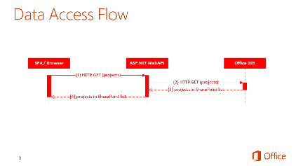

Once the user is authenticated, they then need to get data from SharePoint Online’s REST API or submit creates, updates and deletes.
As we explained on the previous slide, this starts by the single page app (or Office App) issuing an HTTP GET (1) to the WebAPI project. Within this HTTP request, the anti-forgery token and session state ID are included in the header. The WebAPI project uses these values to retrieve the access token from session state.

The WebAPI project then issues HTTP GET, or POST, DELETEs or MERGE requests to the Office 365 API or SharePoint Online REST APIs (2) and includes the access token within the authorization header.

Office 365/SharePoint Online responds accordingly (3) and that response essentially passes through WebAPI straight back to the client (4).

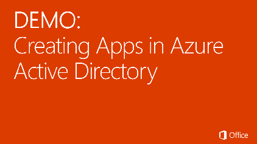

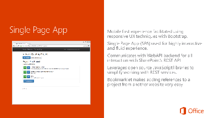

The first app in the scenario is a single page app, also known as a SPA. A SPA is a web application that generally does not have page refreshes, rather portions of the page are swapped out with HTML fragments depending on the current screen. All data is submitted and retrieved from the server, in this case WebAPI, using AJAX calls.

The non-refreshing user experience is implemented using various open source JavaScript libraries such as AngularJS and Breeze among others.

In addition to the SPA, the web app also includes a bookmarklet. A user can drag this to their favorites bar for later use. Then, when they are on another webpage that they want to add as a reference in a project, when they click on the bookmarklet in their favorites bar it will open a new window where they can quickly add the reference to an existing project.

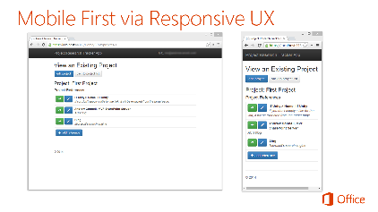

A key precept of the SPA is that it must be responsive and mobile friendly… in fact it was built with a mobile first approach. As you can see from the screenshots above, the experience is modified based on the width of the browser so the same web application codebase will work in a desktop browser or all the way down to a narrow form factor like a phone browser.

This was facilitated using the popular Bootstrap library and augmented using the Angular UI Bootstrap project. The latter rewrites some of the Bootstrap elements in pure Angular code.

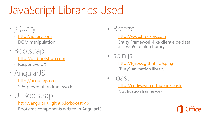

As previously mentioned, the SPA is implemented with various open source JavaScript libraries. This slide contains a list of the libraries used.

First, jQuery is used for just a few DOM manipulation pieces. Angular actually relies on jQuery if it is present, but if it isn’t, Angular uses a subset of jQuery that is implemented by the Angular team and included in Angular called jQLite.

Next, most of the user interface components including the buttons, tables and dialogs are implemented using the popular Bootstrap library.

All SPA’s have common characteristics like navigation, routing, histories, data binding, templating and many more things to name a few. While you can create all this on your own, most developers leverage presentation frameworks which is why AngularJS is used here. AngularJS, an open source project by Google with a very robust and active ecosystem, is a SPA presentation framework.

While not necessary, this sample app also uses the UI Bootstrap library. This is an Angular implementation of the Bootstrap library allowing for some easy ways to implement some controls in the Bootstrap library.

The majority of the data access with the server is handled using a library called Breeze. If you are familiar with Entity Framework you can think of Breeze as a JavaScript and thus, client-side implementation of Entity Framework. It simplifies calls to REST APIs, adds client-side data validation, client-side caching and much more.

When the SPA has to retrieve or submit data to the server for processing, we usually want to “lock” the user interface so the user doesn’t do something while the application is busy. The spin.js library helps with this in adding a spinner like busy animation to show the application is currently working.

And finally we are using the Toastr library to create the notifications that appear in the upper right corner of the application when items are created, updated, deleted or to notify the user of an error.

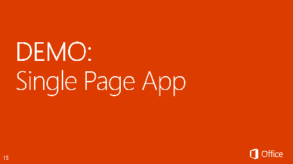

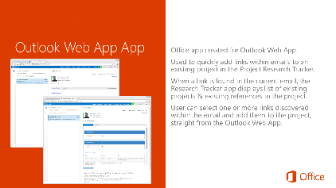

The next app we will look at is the Outlook Web App. This Office app is installed within the Outlook Web App. When it detects a URL within the current email, it shows the app “Research Tracker” in the app menu bar. Clicking on this will open a little window which allows the user to select an existing project and all the links found within the email that they want to add to the project.

Like the SPA, all communication between the Outlook Web App and SharePoint Online’s REST API go through a backend WebAPI project to protect the access token.

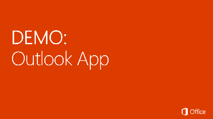

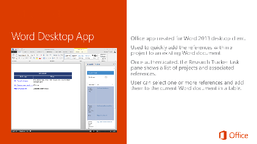

The last app in the scenario is an addin for the desktop version of Microsoft Office Word. When installed it adds a task pane to Word called the Research Tracker.

After logging in the user can pick an existing project and then one or more references found within the project. After selecting the references, when the user click a link within the task page, a new table is added to the current Word document with the name of the project and all the selected references.

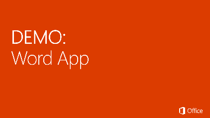

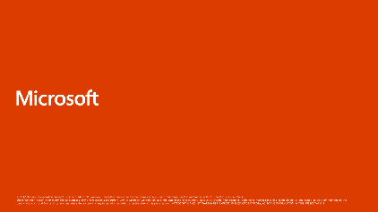
